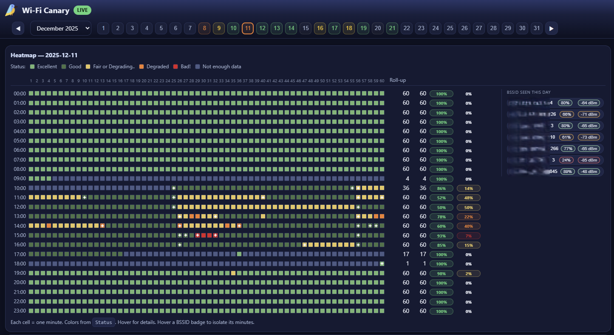

# Wi‑Fi Canary 🦜📶

Minute‑level Wi‑Fi health logger + HTML dashboard for diagnosing flaky home/office networks **from the client side**
(signal/RSSI, BSSID, roaming events, and simple latency indicators). Run it on your laptop and correlate “felt pain”
with measurable patterns.

> Logo attribution: “Kingfisher icons created by Freepik – Flaticon”.

---

## What it does

- **Collector (PowerShell “daemon”)** samples every *N seconds*:
  - Wi‑Fi: SSID, BSSID (AP MAC), channel, signal %, link rate, RSSI (if available)
  - Latency: quick probes to your default gateway and public anycast targets
- Writes a **daily CSV**: `logs/YYYY-MM-DD.csv`
- Builds a **daily ledger** (minute rollups) for the dashboard:
  - `logs/YYYY-MM-DD.ledger.json`
  - `logs/ledger-index.json` (list of available ledgers)
- Generates a **static HTML heatmap** for quick sharing:
  - `logs/YYYY-MM-DD.html`
- Dashboard (single-page web app) reads the ledgers dynamically:
  - `src/dashboard/index.html`
- Consult [this guide for more details](what-is-wifi-canary-doing.md) and general Wi-Fi basics.

## Quick start (Windows)

### Requirements
- Windows 10/11
- PowerShell 7+ recommended
- A Wi‑Fi adapter 🙂 (works best on laptops)
- Enable location services if you want to track AP roaming (important for coverage and dropout discovery)

### ✋Location services note (Windows)

On some Windows versions/configurations, **BSSID** and/or **RSSI** from `netsh wlan show interfaces`
can be missing unless Location Services are enabled.

If you care about roaming and AP identification, enable Location Services for the device and confirm the
indicator shows it’s only used while sampling.

### Folder layout

- `src/daemon/` – PowerShell collector + helper scripts/shortcuts
- `src/dashboard/` – static dashboard (HTML/CSS/JS + optional logo)
- `logs/` – generated artifacts (CSV, ledgers, heatmaps, heartbeat)

### 1) Run the collector (daemon)
From File Explorer, double‑click:

- `reload-wifi-canary.cmd`

This starts (or restarts) the daemon loop (sampling + ledger/index + heatmap generation).

### 2) Start the dashboard web server
Double‑click:

- `start-web-server.cmd`

Then open:

- http://localhost:8080/src/dashboard/

> Tip: if you see a directory listing at `http://localhost:8080/`, it’s normal — the dashboard is under `/src/dashboard/`.

### 3) Stop the collector
Double‑click:

- `stop-wifi-canary.cmd`

### 4) First run checklist (if something doesn’t work)

If wifi-canary doesn’t show data:

1. Confirm PowerShell version:
   pwsh --version   (7.x recommended)

2. Try running the daemon once manually:
   pwsh -File src/daemon/wifi-canary.ps1

3. Check logs folder:
   logs/daemon-errors.log

4. If BSSID/RSSI are missing:
   - Enable Windows Location Services

5. If dashboard shows no data:
   - Ensure logs/ledger-index.json exists
   - Ensure web server is serving repo root

## Contributing

Issues and PRs are welcome. If you’re adding features, please include:
- a short “why”
- sample data (or a screenshot) showing the change in the dashboard
